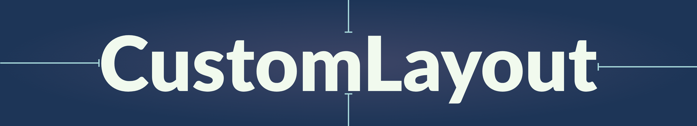

[](https://cocoapods.org/pods/CustomLayout)
[](https://cocoapods.org/pods/CustomLayout)
[](https://cocoapods.org/pods/CustomLayout)

Auto Layout made easy with the Custom Layout.
<br>

## Getting started

#### CocoaPods
[CocoaPods](https://cocoapods.org) is a dependency manager for Cocoa projects. You can install it with the following command:

```ruby
$ gem install cocoapods
```
To integrate CustomLayout into your Xcode project using CocoaPods, specify it in your Podfile:

```ruby
source 'https://github.com/CocoaPods/Specs.git'
platform :ios, '12.0'
use_frameworks!

target '<Your Target Name>' do
    pod 'CustomLayout', '~> 1.0.1'
end
```
Then, run the following command:
```ruby
$ pod install
```

#### Swift Package Manager

[Swift Package Manager](https://swift.org/package-manager/) is a tool for managing the distribution of Swift code. It’s integrated with the Swift build system to automate the process of downloading, compiling, and linking dependencies.

> Xcode 11+ is required to build CustomLayout using Swift Package Manager.

```Swift
dependencies: [
    .package(url: "https://github.com/MnkGitBox/CustomLayout.git", .upToNextMajor(from: "1.0.1"))
]
```

#### Manually

If you prefer not to use either of the aforementioned dependency managers, you can integrate CustomLayout into your project manually.

---

### How to Use
You can call `layout.activate` method provided by the **Custom Layout** library.

 -  Without Custom Layout
```Swift 
view.addSubview(redView)

view.translatesAutoresizingMaskIntoConstraints = false
NSLayoutConstraint.activate([redView.leadingAnchor.constraint(equalTo: view.leadingAnchor,
                                                                    constant: 50),
                            redView.trailingAnchor.constraint(equalTo: view.trailingAnchor,
                                                                    constant: -50),
                            redView.topAnchor.constraint(equalTo: view.safeAreaLayoutGuide.topAnchor,
                                                                    constant: 40),
                            redView.bottomAnchor.constraint(equalTo: view.safeAreaLayoutGuide.bottomAnchor,
                                                                    constant: -20)])
```
 - With Custom Layout
```Swift
view.addSubview(redView)

redView.activateLayouts([.leading(constant: 50), .traling(constant: -50), .top(constant: 40, safeAreaAlign: true), .bottom(constant: -20, safeAreaAlign: true)])
```

#### Layout to sibling views
Custom Layout not only helps to layout subviews to its super view. We can use it to layout view components with other views who share the same ancestors.
```Swift
greenView.layout.activate(to: [view : [.bottom(constant: -2, safeAreaAlign: true), .traling(constant: -20)],
                                    redView : [.leadingToTraling(constant: -10), .topToBottom(constant: 20)]])
```

### Resources

You can find the original sample code [here](../../Example/MNkSupportUtilities/CustomLayout_comp.swift).

## Credits
- Malith Nadeeshan ([malithnadeeshan](https://twitter.com/malithnadeeshan))

## License

CustomLayout is released under the MIT license. See LICENSE for details.
